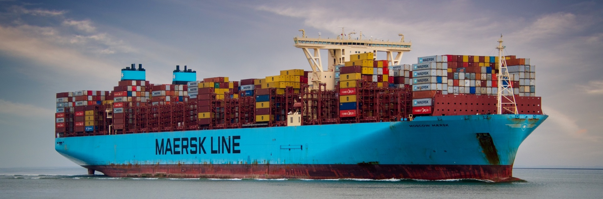

<sub><sub>Image by Freddy Dendoktoor released under license CC0 Public Domain</sub></sub>

# The Feeder Network Design Problem

A solver for a maritime version of the Vehicle Routing Problem with:
* Multiple time windows
* Pickups and deliveries
* Heterogeneous fleet
* Multiple sailing speeds (and costs)
* Maximum transit times

This problem is known in the literature as the Feeder Network Design Problem.

## Citation

If you use this software, please cite the following paper.

```bib
@article{santini2017feeder,
  title={A branch-and-price approach to the {Feeder Network Design Problem}},
  author={Santini, Alberto and Ropke, Stefan and Plum, Christian E.M.},
  journal={{European Journal of Operational Research}},
  pages={607--622},
  volume=264,
  issue=2,
  year=2017,
  doi={10.1016/j.ejor.2017.06.063}
}
```

You can also cite this repository via Zenodo.

[](https://zenodo.org/badge/latestdoi/13000783)

```bib
@misc{fndp_github,
    title={Branch-and-price solver for the Feeder Network Design Problem},
    author={Santini, Alberto},
    date={2017-06-03},
    howpublished={Github repository},
    doi={10.5281/zenodo.802330},
    url={https://github.com/alberto-santini/maritime-vrp/}
}
```

## Organisation

* Folder `cmake` contains cmake modules.
* Folder `data` contains a testbed of instances, based on the [LinerLib](http://www.linerlib.org/) instances.
* Folder `opt` contains support tool to generate instances and launch the solver.
* Folder `src` contains the source code.

## License

This software is distributed under the GNU General Public License v3, as detailed in `LICENSE.txt`.
